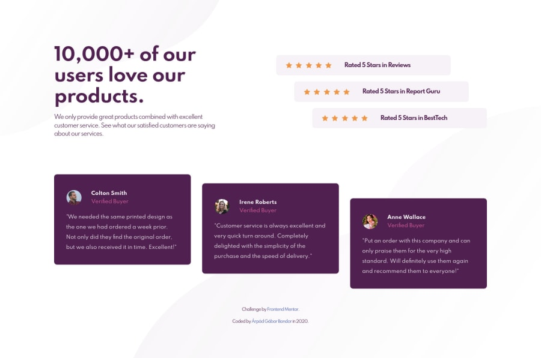

# Frontend Mentor - Social proof section solution

This is a solution to the [Social proof section challenge on Frontend Mentor](https://www.frontendmentor.io/challenges/social-proof-section-6e0qTv_bA). Frontend Mentor challenges help you improve your coding skills by building realistic projects.

## Table of contents

-   [The challenge](#the-challenge)
-   [Screenshot](#screenshot)
-   [Links](#links)
-   [Built with](#built-with)
-   [Author](#author)

## The challenge

Users should be able to:

-   View the optimal layout for the section depending on their device's screen size
    

## Screenshot

## Links

-   Solution URL: [Frontend Mentor solution](https://www.frontendmentor.io/solutions/mobile-first-html5-css3-bootstrap4-CCEoR_WsJ)
-   Live Site URL: [Deployed on Github Pages](https://arpadgbondor.github.io/Web_challenge_1-Frontend_Mentor-Social_proof_section/)

## Built with

-   HTML5
-   CSS3
-   Bootstrap4
-   Mobile-first workflow

## Author

-   Website - [Arpad G. Bondor](https://github.com/ArpadGBondor)
-   Frontend Mentor - [ArpadGBondor](https://www.frontendmentor.io/profile/ArpadGBondor)
